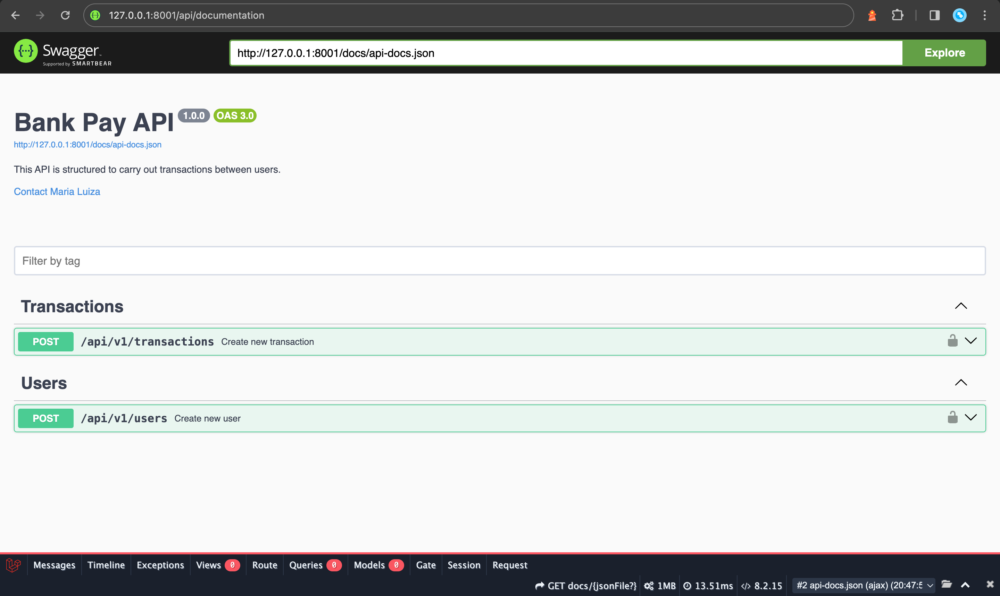

# API Bank Pay  


 Essa API é estruturada para realizar transações entre clientes.
 
---
## Regras de Negócio   

 

### Cadastro de usuário:  

- Existem dois tipos de clientes: regulares e comerciantes.  

- Nome Completo, CPF/CNPJ, E-mail e Senha são campos obrigatórios para ambos os tipos de usuários: usuários regulares e comerciantes.  

- CPF/CNPJ (Cadastro Nacional da Pessoa Jurídica) e e-mails são únicos no sistema, permitindo apenas um cadastro por CPF ou endereço de e-mail.  

  

### Transferência de dinheiro:  

- Os usuários podem enviar dinheiro (fazer transferências) tanto para comerciantes quanto para outros usuários.  

- Os comerciantes recebem apenas transferências; eles não podem enviar dinheiro para ninguém.  

  

### Validação de saldo:  

- Antes de concluir uma transferência, o sistema valida se o cliente possui saldo suficiente em sua carteira.  

  

### Autorização Externa:  

- Antes de finalizar uma transferência, o sistema consulta um serviço de autorização externo para autorizar ou não a transferência.  

  

### Tratamento de transações:  

 - A operação de transferência é uma transação, ou seja, é reversível em caso de alguma inconsistência e o valor devolvido a carteira do cliente.  

  

### Notificação sobre recibo de pagamento:  

- Ao receber o pagamento, tanto usuários quanto comerciantes deverão receber uma notificação. As notificações são enviadas por e-mail por meio de um serviço terceirizado.   

- O serviço de notificação de terceiros pode ocasionalmente estar indisponível ou instável, por isso, é gerado um registro no banco de dados, para salvar essa informação.  

  

### Serviço RESTFul:  

- O sistema é concebido como um serviço RESTFul para facilitar a comunicação e integração com sistemas externos. 

 
---
## Estrutura do projeto 

- Esse projeto segue uma abordagem MVC modificada, adaptada às necessidades de uma API REST, seguindo os princípios de separação de responsabilidades. Além disso, também segue os padrões de Service Layer e Repository Pattern. 

 

### Principais estruturas do projeto 

```

App/: Contém a lógica principal da aplicação. 

├── Console/: Armazena comandos personalizados para a interface de linha de comando Artisan. 

├── Contracts/: Contém todas as interfaces que definem os contratos para as classes em diferentes partes da aplicação. 

├── Exceptions/: Contém classes para lidar com exceções personalizadas da aplicação. 

└── HTTP/: Este diretório contém controladores, middlewares e classes de validação de requisições HTTP. 

    ├── Controllers/: Recebem as requisições HTTP da aplicação e respondem com a lógica adequada. 

    ├── Middleware/: Funcionalidades intermediárias entre as requisições HTTP e as respostas da aplicação. 

    └── Requests/: Classes que lidam com a validação das requisições HTTP. 

├── Models/: Modelos que representam as tabelas do banco de dados. 

├── Providers/: Provedores de serviços da aplicação, responsáveis por inicializar e registrar serviços durante o bootstrap da aplicação. 

├── Repositories/: Classes responsáveis pela comunicação com o banco de dados, seguindo o padrão Repository. 

└── Services/: Classes que contêm a lógica de negócios da aplicação. 

Database/: Contém arquivos relacionados ao banco de dados da aplicação. 

├── Factories/: Arquivos de fábrica usados para gerar dados fictícios durante o desenvolvimento e teste da aplicação. 

├── Migrations/: Arquivos de migração que definem a estrutura do banco de dados e as alterações nas tabelas. 

└── Seeders/: Classes usadas para popular o banco de dados com dados iniciais durante a inicialização. 

Routes/: Contém todas as definições de rotas da aplicação. 

Tests/: Armazena os testes de unidade e de integração da aplicação. 

Vendor/: Contém as dependências do projeto, gerenciadas pelo Composer. 

```

---

## Documentação 

- A documentação do projeto foi elaborada com o uso do Swagger, acessível através do seguinte caminho: "/api/documentation". 



---
## Tecnologias

- Laravel
- PHP
- MySQL
- PHPUnit
- Swagger
- Docker

---
## Requisitos

- Docker
- Docker Compose

---
## Instalação 

- 1- Primeiro você deve clonar esse repositório em sua máquina.
- 2- Após instalação dos requitos, você deve executar os comandos abaixo em seu terminar (no diretório do projeto):
```
./vendor/bin/sail up
./vendor/bin/sail artisan migrate
```

---
## Testes

- Para realizar os testes unitários e de integração, execute em seu terminal (no diretório do projeto) o comando abaixo:
```
./vendor/bin/sail artisan test 
```


